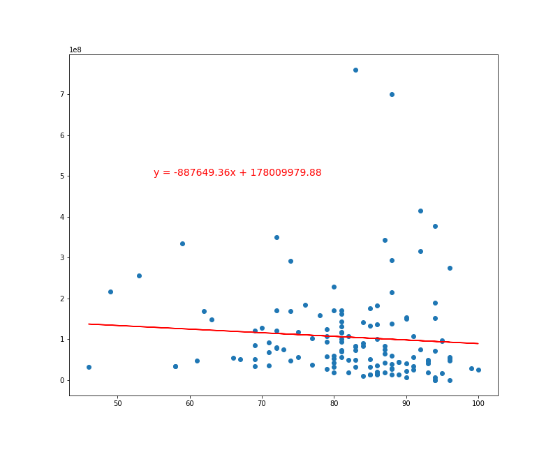

# Project-2-The-Movie-Biz

PROPOSAL

We want to explore the relationship between movie Metacritic scores and box office numbers / Oscar nominations and wins. Is there any correlation between a film's score and how much money they make? And can the score even predict an Oscar win?

EXTRACT

Our data sources are:

Kaggle - We found a csv that included info on all the Oscar winners and nominees.

OMDB - We used the OMDB API to obtain box office data and metascores for each film.

TRANSFORM

For the Oscar csv file, we used only the Best Picture winners and nominees from 2001 to 2019. (The reason for this timeframe is because Metacritic was launched in 2001.)  This involved dropping the other categories (Best Director, Best Actor, etc.) and years (1921-2000).

Then to obtain box office and Metascore information, we took data from the OMDB API (using the Oscar nominees and winners from the previous CSV) and converted that into a new CSV. 

Finally, we merged the two dataframes together to give us data that could be loaded into our final database.  For our 

LOAD

The data that we extracted and cleaned was then loaded into a Postgres database.

ANALYSIS

What we discovered is that for the Oscar nominees and winners (2001-2019), the films with the lower critic scores made more money at the box office.
